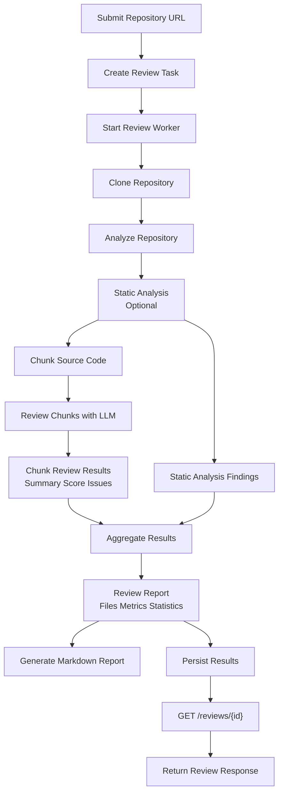

```mermaid
flowchart TD
    A[Submit Repository URL] --> B[Create Review Task]
    B --> C[Start Review Worker]

    C --> D[Clone Repository]
    D --> E[Analyze Repository]
    E --> F["Static Analysis<br/>Optional"]
    F --> G[Chunk Source Code]
    G --> H[Review Chunks with LLM]

    H --> I["Chunk Review Results<br/>Summary Score Issues"]
    F --> J[Static Analysis Findings]

    I --> K[Aggregate Results]
    J --> K

    K --> L["Review Report<br/>Files Metrics Statistics"]
    L --> M[Generate Markdown Report]
    L --> N[Persist Results]

    N --> O["GET /reviews/{id}"]
    O --> P[Return Review Response]
```